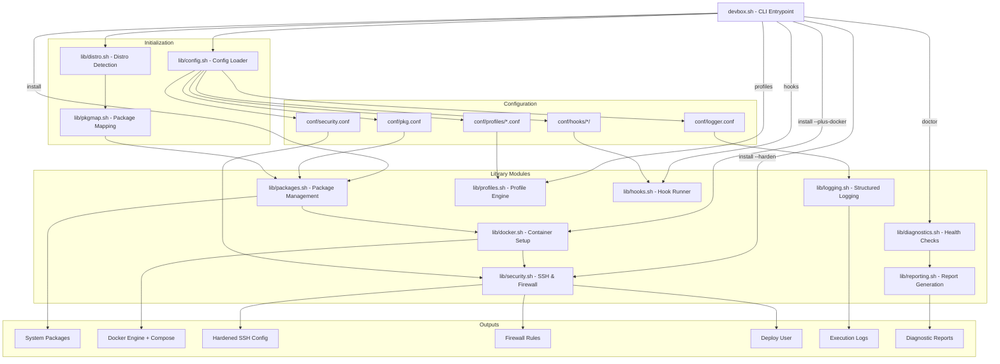
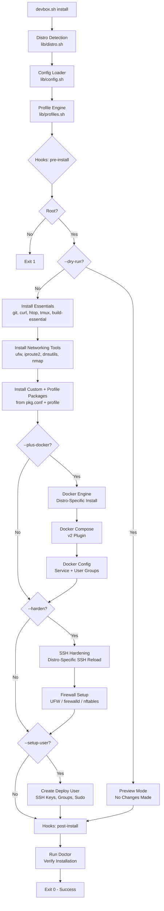
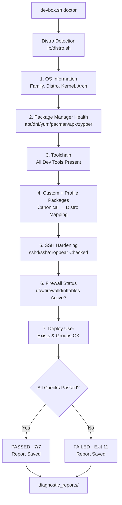
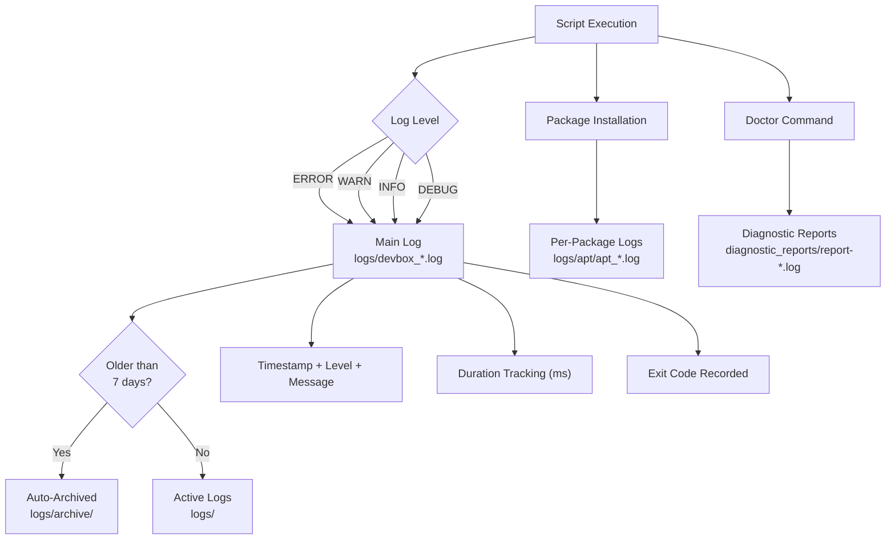
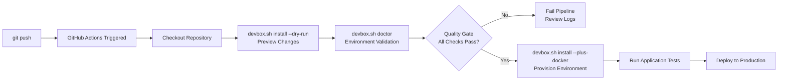

# DevBox

**Infrastructure-as-Code for development environments — automated provisioning, container orchestration, and observability for any Linux distribution.**

[](https://opensource.org/licenses/MIT)
[](https://github.com/PavaraM/devbox)
[](https://www.gnu.org/software/bash/)
[](https://github.com/PavaraM/devbox)

DevBox is an **infrastructure automation tool** that provisions consistent, production-ready development environments on any Linux distribution. It handles package management, Docker container orchestration, system diagnostics, and observability logging — all through a modular IaC (Infrastructure as Code) architecture with idempotent execution, granular error handling, and a dry-run mode for safe change previews.

---

## Features

🧩 **Infrastructure as Code** — Declarative, modular, and version-controlled environment provisioning  
⚡ **Idempotent Execution** — Safe to run repeatedly; already-configured state is detected and skipped  
🐳 **Container Platform** — Docker Engine + Compose plugin with automatic service setup and user access  
🩺 **Observability** — Comprehensive diagnostic engine with health checks, reporting, and monitoring  
📊 **Structured Logging** — Multi-level logs (DEBUG/INFO/WARN/ERROR) with auto-archival and duration tracking  
🔐 **SSH Hardening** — Automated secure SSH configuration with strong ciphers, key-only auth, and safe defaults  
🛡️ **Firewall Management** — UFW firewall with configurable allow-lists and rate-limited SSH access  
👤 **Deploy User** — Automated deploy user creation with SSH keys, group membership, and sudo configuration  
👁️ **Change Preview** — `--dry-run` mode to review modifications before applying them  
🎯 **Extensible** — Custom packages via `conf/pkg.conf`, modular library design for easy extension  
🐧 **Multi-Distro** — Supports Debian, Ubuntu, Fedora, RHEL, Arch Linux, Alpine, openSUSE  
🎛️ **Profiles** — 10 pre-built profiles (minimal to cloud-dev), composable with `--profile`  
🔌 **Hook System** — 8 lifecycle phases with user-defined scripts  
🚀 **Zero-Dep Bootstrap** — `curl | sh` installer works on any POSIX system  
📋 **CI/CD Ready** — Scriptable, automated, with detailed exit codes for pipeline integration

---

## Architecture



---

## Quick Start

### One-Line Install (Recommended)

```bash
curl -fsSL https://raw.githubusercontent.com/PavaraM/devbox/v2/bootstrap.sh | sh
```

> **Security Note:** The examples above use the **mutable `v2` branch**, which
> can be force-pushed. For production, **pin to an immutable release tag**
> (e.g., `v2.0.0`). This applies to `bootstrap.sh` **and** the `devbox.sh` and
> `lib/*.sh` files it fetches — the entire chain must use the same pinned ref.
>
> **Recommended verification:**
> 1. Download: `curl -fsSL -O https://github.com/PavaraM/devbox/raw/v2.0.0/bootstrap.sh`
> 2. Review: `less bootstrap.sh`
> 3. Verify checksums: `curl -fsSL https://github.com/PavaraM/devbox/releases/download/v2.0.0/SHA256SUMS | sha256sum -c --ignore-missing`
> 4. Execute: `sh bootstrap.sh`
>
> The same tag pins `bootstrap.sh`, `devbox.sh`, and all `lib/*.sh` to a
> single immutable snapshot, so no code is fetched from a moving target.

With a profile:

```bash
curl -fsSL https://raw.githubusercontent.com/PavaraM/devbox/v2/bootstrap.sh | sh -s -- --profile python-dev
```

### Manual Install

```bash
# Clone the repository
git clone https://github.com/PavaraM/devbox.git
cd devbox

# Make the script executable
chmod +x devbox.sh

# Install essential packages
sudo ./devbox.sh install

# Preview installation (no changes made)
sudo ./devbox.sh install --dry-run

# Install with Docker support
sudo ./devbox.sh install --plus-docker

# Run diagnostics
sudo ./devbox.sh doctor
```

---

## Installation

### Prerequisites

- **Any Linux distribution** — Debian, Ubuntu, Fedora, RHEL, Arch, Alpine, openSUSE
- **Root/sudo access**
- **Internet connection**
- **bash** (installed by bootstrap.sh if missing)

### Project Structure

```
devbox/
├── devbox.sh              # Main CLI entrypoint
├── bootstrap.sh           # Zero-dependency POSIX installer
├── conf/                  # Configuration files
│   ├── pkg.conf           # Custom package configuration
│   ├── logger.conf        # Logger configuration
│   ├── security.conf      # SSH, firewall, and deploy user settings
│   ├── profiles/          # Profile definitions
│   │   ├── minimal.conf
│   │   ├── base.conf
│   │   ├── standard.conf
│   │   ├── full.conf
│   │   ├── secure.conf
│   │   ├── python-dev.conf
│   │   ├── node-dev.conf
│   │   ├── go-dev.conf
│   │   ├── rust-dev.conf
│   │   └── cloud-dev.conf
│   └── hooks/             # Lifecycle hook scripts
│       ├── pre-install/
│       ├── post-install/
│       ├── pre-docker/
│       ├── post-docker/
│       ├── pre-harden/
│       ├── post-harden/
│       ├── pre-user/
│       └── post-user/
├── lib/                   # Library modules
│   ├── distro.sh          # Multi-distro detection
│   ├── pkgmap.sh          # Package name mapping
│   ├── config.sh          # Configuration loader (hierarchical)
│   ├── profiles.sh        # Profile engine
│   ├── hooks.sh           # Hook runner
│   ├── packages.sh        # Package management
│   ├── docker.sh          # Container setup
│   ├── security.sh        # SSH hardening, firewall, deploy user
│   ├── diagnostics.sh     # System diagnostics & health checks
│   ├── reporting.sh       # Diagnostic report generation
│   └── logging.sh         # Structured logging
├── logs/                  # Execution logs (auto-created)
│   ├── devbox_*.log       # Main script logs
│   ├── apt/               # Per-package installation logs
│   │   └── apt_*.log
│   └── archive/           # Archived logs (7+ days old)
├── diagnostic_reports/    # System diagnostic reports
│   ├── report-*.log       # Timestamped diagnostic reports
│   └── archive/           # Archived reports
├── docs/
│   ├── API.md             # API documentation for developers
│   ├── DEBUGGING.md       # Debugging guide
│   └── QUICKREF.md        # Quick reference guide
├── LICENSE                # MIT License
└── VERSION                # Version information
```

---

## Execution Flow



---

## Usage

### Commands

#### `install`
Set up your development environment with essential packages.

```bash
sudo ./devbox.sh install
```

**Installs:**

**Core Development Tools:**
- **Version Control**: git-all
- **Network Tools**: curl, wget, net-tools, ca-certificates
- **System Utilities**: htop, tmux, tree, unzip
- **Development**: neovim, build-essential

**Networking Tools:**
- **Firewall**: ufw (Uncomplicated Firewall)
- **Network Utilities**: iproute2, dnsutils, nmap

**Custom Packages:**
- Any packages defined in `pkg.conf`

#### `install --plus-docker`
Install everything plus Docker and Docker Compose.

```bash
sudo ./devbox.sh install --plus-docker
```

**Additionally configures:**
- Docker Engine (latest stable via official script)
- Docker Compose plugin (v2.24.5)
- Docker service auto-start on boot
- User permissions for non-root Docker access
- Architecture detection (x86_64, aarch64, armv7)

> **Note:** You'll need to log out and back in for Docker group permissions to take effect.

#### `install --harden`
Harden the system's security posture.

```bash
sudo ./devbox.sh install --harden
sudo ./devbox.sh install --plus-docker --harden
```

**Performs:**
- **SSH Hardening**: Disables root login, enforces key-based auth, disables X11 forwarding, sets strong ciphers/MACs/KexAlgorithms, configures idle timeouts, rate-limits auth attempts — original config backed up to `/etc/ssh/sshd_config.devbox.bak`
- **UFW Firewall**: Default deny incoming, default allow outgoing, rate-limit SSH (port 22), open additional ports (80, 443 by default — configurable in `conf/security.conf`)

#### `install --setup-user <username>`
Create a deploy user with SSH access, group memberships, and sudo privileges.

```bash
sudo ./devbox.sh install --setup-user deploy
sudo ./devbox.sh install --all --setup-user deploy
```

**Creates:**
- System user with home directory and `.ssh/authorized_keys`
- SSH key pair (auto-generated if no public key provided via `DEPLOY_SSH_PUBLIC_KEY` env var or `conf/deploy_key.pub`)
- Group memberships (docker, sudo — configurable in `conf/security.conf`)
- Passwordless sudo configuration

#### `--all` / `-a`
Run the full DevBox setup in one command: install + Docker + security hardening.

```bash
sudo ./devbox.sh --all
sudo ./devbox.sh -a --setup-user deploy
```

This is a shorthand for `install --plus-docker --harden`. Can be combined with `--setup-user` for a complete environment provisioning.

#### `install --dry-run`
Preview what would be installed without making any changes to the system.

```bash
sudo ./devbox.sh install --dry-run
sudo ./devbox.sh install --plus-docker --dry-run
sudo ./devbox.sh --all --dry-run
```

**Behavior:**
- Checks which packages are already installed
- Reports what would be installed (skips already-present packages)
- For Docker and security steps: prints the actions that would be taken
- No files are modified, no packages are installed
- Full log output is still written to the log file

Ideal for reviewing changes before applying them, or for CI pipelines that need to verify setup steps without executing them.

#### `doctor`
Run comprehensive diagnostic checks on your environment.

```bash
sudo ./devbox.sh doctor
```

**Diagnostic Checks:**
1. **OS Information**
   - Distribution, version, and family
   - Kernel version and architecture
   - User permissions and internet connectivity

2. **Package Manager Health**
   - Detects apt / dnf / yum / pacman / apk / zypper
   - Lock status and broken package detection

3. **Toolchain Verification**
   - Checks for all essential development tools
   - Validates networking utilities
   - Uses distro-aware package name mapping

4. **Custom + Profile Package Verification**
   - Validates packages from `pkg.conf` and active profile
   - Maps canonical names to distro-specific names

5. **SSH Hardening Check**
   - Verifies SSH configuration (sshd/ssh/dropbear)
   - Reports if SSH hardening has been applied

6. **Firewall Status Check**
   - Detects active firewall (ufw / firewalld / nftables)
   - Alerts if no firewall is configured

7. **Deploy User Check**
   - Verifies deploy user exists
   - Checks configured group memberships

**Output:**
- Generates timestamped diagnostic report in `diagnostic_reports/`
- Displays summary with pass/fail status
- Logs detailed results for troubleshooting

Example output:
```
Running diagnostics...
[INFO] Family: debian
[INFO] Distro: Ubuntu 24.04 LTS
[INFO] Kernel: 6.17.0-14-generic
[INFO] Architecture: x86_64
[INFO] Internet Connectivity: online
[INFO] Package manager (apt) is healthy
[INFO] All essential development tools are present
[INFO] All custom + profile packages are present
[INFO] SSH hardening is applied
[INFO] Firewall (ufw) is active
[INFO] Deploy user deploy exists
=======================
Diagnostic Summary
status: PASSED
checks_passed: 7/7
report generated at: diagnostic_reports/report-2026-02-14-01-45-38.log
=======================
```

### Diagnostic Flow



#### `--help`
Display usage information and exit codes.

```bash
./devbox.sh --help
```

#### `distro`
Display detected distribution information.

```bash
./devbox.sh distro
```

Example output:
```
Family:     debian
Distro:     Ubuntu
Version:    24.04
ID:         ubuntu
ID_LIKE:    debian
Kernel:     6.17.0-14-generic
Arch:       x86_64
Package:    apt
Service:    systemctl
Firewall:   ufw
```

#### `profiles`
List available profiles and their descriptions.

```bash
./devbox.sh profiles
```

#### `hooks`
List available lifecycle hooks.

```bash
./devbox.sh hooks
```

#### `shell`
Generate shell completion script.

```bash
# Bash
eval "$(./devbox.sh shell bash)"

# Zsh
eval "$(./devbox.sh shell zsh)"
```

---

## Profiles

DevBox includes 10 pre-built profiles for common environments. Profiles are composable — use `--profile` multiple times to combine them.

| Profile | Packages | Services |
|---------|----------|----------|
| `minimal` | git, curl | — |
| `base` | git, curl, vim, htop, tmux, tree, unzip | — |
| `standard` | base + build-essential, ca-certificates, net-tools | — |
| `full` | standard + docker, harden, deploy user | Docker, UFW, SSH |
| `secure` | (config only) | SSH hardening, UFW, deploy user |
| `python-dev` | python3, pip, venv, build-essential, git | — |
| `node-dev` | nodejs, npm, git, build-essential | — |
| `go-dev` | golang, git, build-essential | — |
| `rust-dev` | rustc, cargo, build-essential, git | — |
| `cloud-dev` | docker, kubectl, helm, terraform | Docker |

Usage:

```bash
# Install with a Python development profile
sudo ./devbox.sh install --profile python-dev

# Combine profiles
sudo ./devbox.sh install --profile python-dev --profile node-dev
```

Profile configuration is loaded from `conf/profiles/<name>.conf` and can be overridden via the config hierarchy (`./devbox.conf`, `~/.config/devbox/config.conf`, `/etc/devbox/config.conf`).

## Hook System

DevBox supports 8 lifecycle phases for custom scripts:

| Phase | When it runs |
|-------|-------------|
| `pre-install` | Before package installation |
| `post-install` | After package installation |
| `pre-docker` | Before Docker setup |
| `post-docker` | After Docker setup |
| `pre-harden` | Before security hardening |
| `post-harden` | After security hardening |
| `pre-user` | Before deploy user creation |
| `post-user` | After deploy user creation |

Place executable scripts in `conf/hooks/<phase>/`:

```bash
# Example: conf/hooks/pre-install/10-preflight.sh
#!/bin/bash
df -h / | tail -1 | awk '{ if ($5+0 > 90) { print "WARNING: disk usage at "$5; exit 1 } }'
```

---

## Exit Codes

DevBox uses granular exit codes for precise error identification:

| Code | Meaning |
|------|---------|
| Code | Meaning |
|------|---------|
| `0` | Success |
| `1` | Missing root permissions |
| `2` | No argument provided |
| `3` | Invalid argument |
| `4` | Library loading failure |
| `5` | Package installation failure |
| `6` | Docker installation failure |
| `7` | Docker service failure |
| `8` | Docker group setup failure |
| `9` | Docker Compose installation failure |
| `10` | Docker verification failure |
| `11` | Diagnostic check failure |
| `12` | No internet connection for diagnostics |
| `13` | Essential tool missing in diagnostics |
| `14` | Package manager is not healthy |
| `15` | SSH hardening failure |
| `16` | Firewall configuration failure |
| `17` | Deploy user setup failure |
| `18` | Distro detection failure |
| `19` | Profile load failure |
| `20` | Config parse failure |
| `21` | Hook execution failure |

---

## Logging System

Every execution creates detailed, timestamped log files:

### Log Types

**Main Execution Logs:**
```
logs/devbox_2026-02-14.log
```

**Per-Package APT Logs:**
```
logs/apt/apt_2026-02-14-git.log
logs/apt/apt_2026-02-14-curl.log
logs/apt/apt_2026-02-14-docker.log
```

**Diagnostic Reports:**
```
diagnostic_reports/report-2026-02-14-01-45-38.log
```

### Log Features

📝 **Main log** - Overall script execution with all operations  
📦 **Per-package APT logs** - Individual installation details and errors  
🩺 **Diagnostic reports** - System health check results  
🗄️ **Auto-archival** - Logs older than 7 days moved to `archive/`  
👤 **User ownership** - All logs owned by your user, not root  
⏱️ **Duration tracking** - Precise execution time in milliseconds  

### Log Format

```
script started at Sat Feb 14 01:45:38 +0530 2026
command: devbox install --plus-docker
system: Linux OBSIDIAN 6.17.0-14-generic x86_64
user: root (SUDO_USER: pavara)
------------------------------
 
2026-02-14 01:45:38 [INFO] Script started with command: install
2026-02-14 01:45:38 [DEBUG] Checking library: /path/to/lib/packages.sh
2026-02-14 01:45:38 [INFO] Library "packages.sh" is present and executable
2026-02-14 01:45:38 [INFO] "lib/packages.sh" loaded successfully
2026-02-14 01:45:38 [INFO] Starting installation process
2026-02-14 01:45:38 [DEBUG] Checking if git is installed...
2026-02-14 01:45:39 [INFO] git installation successful
...
------------------------------
Script ended at Sat Feb 14 01:45:40 +0530 2026 exit_code=0 duration=2.192s
==============================
```

### Log Levels

- **INFO** - Successful operations and milestones
- **DEBUG** - Detailed operation information
- **ERROR** - Failed operations with context
- **WARN** - Non-critical issues (e.g., offline status)

### Logging Pipeline



---

## Advanced Usage

### Custom Package Installation

DevBox supports custom package installation via the `conf/pkg.conf` file:

**Edit `conf/pkg.conf`:**
```bash
CUSTOM_PACKAGES=(
    "python3-pip"
    "nodejs"
    "npm"
    "golang-go"
)
```

Then run:
```bash
sudo ./devbox.sh install
```

Custom packages are automatically:
- Checked during installation
- Validated during `doctor` diagnostics
- Logged separately for easy troubleshooting

### Modifying Core Packages

Edit `lib/packages.sh` to add your own package groups:

```bash
main_essentials() {
    log INFO "Installing essential development packages..."
    local failed_packages=()
    
    # Existing packages
    check_and_install_apt git git-all || failed_packages+=("git")
    check_and_install_apt curl curl || failed_packages+=("curl")
    
    # Add your custom packages here
    check_and_install_apt python3 python3-pip || failed_packages+=("python3")
    check_and_install_apt nodejs npm || failed_packages+=("nodejs")
    check_and_install_apt golang golang-go || failed_packages+=("golang")
    
    # Report results
    if [ ${#failed_packages[@]} -eq 0 ]; then
        log INFO "All essential packages installed successfully"
        return 0
    else
        log ERROR "Failed to install ${#failed_packages[@]} package(s): ${failed_packages[*]}"
        return 5
    fi
}
```

### Disable Networking Tools

The `networkingtools()` function is enabled by default. To disable it, modify `devbox.sh`:

```bash
run_install() {
    log INFO "Starting installation process"
    main_essentials
    # networkingtools  # Comment this out to disable
    custom_packages
    log INFO "Installation completed successfully"
}
```

---

## Troubleshooting

### Common Issues

**Package Installation Failed:**
```bash
# Check which package failed
grep "installation failed" logs/devbox_*.log

# View package-specific log
cat logs/apt/apt_*-git.log  # Debian/Ubuntu
# or check dnf/yum/pacman/apk logs on other distros

# Retry after fixing package manager
sudo ./devbox.sh doctor
sudo ./devbox.sh install
```

**Docker Permission Denied:**
```bash
# Add user to docker group
sudo usermod -aG docker $USER

# Apply changes (choose one):
newgrp docker    # Current session
logout           # Then login again
```

**APT Locked:**
```bash
[ERROR] dpkg is locked

Solution:
# Wait for other package operations to complete, or:
sudo rm /var/lib/dpkg/lock-frontend
sudo rm /var/lib/dpkg/lock
sudo dpkg --configure -a
```

### Debug Mode

Enable console logging by editing `lib/logging.sh`:

```bash
log() {
    local level=$1
    shift
    local line="$(date +%Y-%m-%d' '%H:%M:%S) [$level] $*"
    
    # Uncomment for console output:
    echo "$line"
    
    echo "$line" >> "$logfile"
}
```

### Viewing Logs

```bash
# Latest main log
tail -f logs/devbox_$(date +%Y-%m-%d).log

# Specific package installation
cat logs/apt/apt_*-git.log

# Latest diagnostic report
cat diagnostic_reports/report-*.log | tail -1

# All errors from today
grep ERROR logs/devbox_$(date +%Y-%m-%d).log
```

---

## Examples

### Fresh Ubuntu Server Setup

```bash
# Initial system setup
sudo apt update && sudo apt upgrade -y

# Install DevBox
git clone https://github.com/PavaraM/devbox.git
cd devbox
chmod +x devbox.sh

# Full installation with Docker
sudo ./devbox.sh install --plus-docker

# Verify installation
sudo ./devbox.sh doctor

# Start using Docker (after re-login)
docker run hello-world
```

### Continuous Integration Server

```bash
# Install only essential tools (no Docker)
sudo ./devbox.sh install

# Verify environment
sudo ./devbox.sh doctor

# Check report
cat diagnostic_reports/report-*.log
```

### Development Workstation

```bash
# Add custom packages first
nano conf/pkg.conf
# Add: python3-pip, nodejs, npm, etc.

# Full setup with Docker
sudo ./devbox.sh install --plus-docker

# Periodic health checks
sudo ./devbox.sh doctor
```

## DevOps & CI/CD Integration

DevBox is designed for automation workflows and integrates naturally into DevOps pipelines:

### CI/CD Pipeline Usage

```yaml
# GitHub Actions example: verify environment on self-hosted runner
jobs:
  setup:
    runs-on: [self-hosted, linux, ubuntu]
    steps:
      - uses: actions/checkout@v4
      - name: Preview changes
        run: sudo ./devbox.sh install --dry-run
      - name: Run diagnostics
        run: sudo ./devbox.sh doctor
      - name: Provision
        run: sudo ./devbox.sh install --plus-docker
```

### Infrastructure as Code

- **Single-source-of-truth** — one script defines the entire dev environment
- **Git-versioned** — environment changes go through code review
- **Reproducible** — identical setup across laptops, servers, and CI runners
- **Auditable** — every run produces timestamped logs and diagnostic reports

### Observability

| Capability | What it provides |
|---|---|
| Diagnostic reports | Snapshot of system health for trend analysis |
| Structured logs | Multi-level logging for log aggregator integration |
| Exit codes | Machine-parseable outcomes for automated alerting |
| Duration tracking | Performance baselining for infrastructure changes |

### CI/CD Pipeline



### Automation Examples

```bash
# Automated nightly health check
0 2 * * * /opt/devbox/devbox.sh doctor >> /var/log/devbox-cron.log 2>&1

# Pre-deployment validation
./devbox.sh doctor || { echo "Unhealthy — aborting deploy"; exit 1; }

# Bulk new-hire provisioning
for user in "${new_joinees[@]}"; do
    sudo ./devbox.sh install --plus-docker
    sudo usermod -aG docker "$user"
done
```

---

## Best Practices

### Installation
- Always run `doctor` after `install` to verify setup
- Use `--dry-run` first to preview what will be installed
- Review logs if any package fails to install
- Run `install` again if network issues interrupted first attempt
- Use `conf/pkg.conf` for custom packages instead of modifying core code

### Logging
- Check the main log for overview: `logs/devbox_$(date +%Y-%m-%d).log`
- Check package-specific logs for detailed errors: `logs/apt/`
- Archive old logs manually if disk space is limited

### Docker
- After Docker installation, log out and back in for group changes
- Test with `docker run hello-world` before production use
- Use `docker compose` (not `docker-compose`) for modern plugin

### Diagnostics
- Run `doctor` periodically to catch configuration drift
- Save diagnostic reports for troubleshooting history
- Use diagnostic reports when seeking support

### Custom Packages
- Use `pkg.conf` for project-specific or environment-specific packages
- Keep core packages in `lib/packages.sh` for universal needs
- Document your custom packages for team members

---

## Contributing

Contributions are welcome! Please feel free to submit a Pull Request.

### Development Setup

```bash
# Fork and clone the repository
git clone https://github.com/YOUR_USERNAME/devbox.git
cd devbox

# Create a feature branch
git checkout -b feature/your-feature-name

# Make your changes
vim lib/packages.sh

# Test your changes
sudo ./devbox.sh install
sudo ./devbox.sh doctor

# Check logs for issues
tail -f logs/devbox_*.log

# Commit and push
git add .
git commit -m "Add: your feature description"
git push origin feature/your-feature-name
```

### Coding Standards

**Shell Scripting:**
- Use `set -euo pipefail` for error handling
- Quote all variables: `"$variable"`
- Use `readonly` for constants
- Use `local` for function variables
- Prefer `[[` over `[` for conditionals

**Logging:**
- Add descriptive log messages for all operations
- Use appropriate log levels (INFO, DEBUG, ERROR, WARN)
- Include context in error messages

**Error Handling:**
- Return specific exit codes (see Exit Codes section)
- Fail fast with early validation
- Clean up temporary files on failure

**Ownership:**
- Fix ownership of created files with `chown "$SUDO_USER:$SUDO_USER"`
- Ensure all logs are user-accessible

**Documentation:**
- Update README for user-facing changes
- Add inline comments for complex logic
- Update exit codes table if adding new codes

### Testing Checklist

Before submitting a PR:
- [ ] Test on Debian/Ubuntu (apt)
- [ ] Test on Fedora/RHEL (dnf)
- [ ] Test on Arch Linux (pacman)
- [ ] Test on Alpine Linux (apk)
- [ ] Test `install` command
- [ ] Test `install --profile <name>` with various profiles
- [ ] Test `install --plus-docker` command
- [ ] Test `install --dry-run` and `install --plus-docker --dry-run`
- [ ] Test `doctor` command
- [ ] Test `distro` command
- [ ] Test `shell` command (bash/zsh autocompletion)
- [ ] Test with and without internet
- [ ] Verify log file creation and ownership
- [ ] Verify diagnostic report generation
- [ ] Run shellcheck on all .sh files
- [ ] Update documentation

---

## Security

### Reporting Vulnerabilities

If you discover a security vulnerability, please email:
**pavaramirihagalla@icloud.com**

Please do not open public issues for security vulnerabilities.

### Security Considerations

- DevBox requires root access for system-level operations
- Docker installation uses official Docker scripts
- All downloads use HTTPS
- Logs may contain sensitive system information
- User credentials are never logged

---

## License

This project is licensed under the MIT License.

```
MIT License

Copyright (c) 2026 Pavara Mirihagalla

Permission is hereby granted, free of charge, to any person obtaining a copy
of this software and associated documentation files (the "Software"), to deal
in the Software without restriction, including without limitation the rights
to use, copy, modify, merge, publish, distribute, sublicense, and/or sell
copies of the Software, and to permit persons to whom the Software is
furnished to do so, subject to the following conditions:

The above copyright notice and this permission notice shall be included in all
copies or substantial portions of the Software.

THE SOFTWARE IS PROVIDED "AS IS", WITHOUT WARRANTY OF ANY KIND, EXPRESS OR
IMPLIED, INCLUDING BUT NOT LIMITED TO THE WARRANTIES OF MERCHANTABILITY,
FITNESS FOR A PARTICULAR PURPOSE AND NONINFRINGEMENT. IN NO EVENT SHALL THE
AUTHORS OR COPYRIGHT HOLDERS BE LIABLE FOR ANY CLAIM, DAMAGES OR OTHER
LIABILITY, WHETHER IN AN ACTION OF CONTRACT, TORT OR OTHERWISE, ARISING FROM,
OUT OF OR IN CONNECTION WITH THE SOFTWARE OR THE USE OR OTHER DEALINGS IN THE
SOFTWARE.
```

---

## Acknowledgments

- Inspired by the need for consistent development environments
- Built with best practices from the bash scripting community
- Docker installation uses official Docker convenience scripts
- Thanks to all contributors and users for feedback and improvements

---

## Support

- **Issues**: [GitHub Issues](https://github.com/PavaraM/devbox/issues)
- **Discussions**: [GitHub Discussions](https://github.com/PavaraM/devbox/discussions)
- **Email**: pavaramirihagalla@icloud.com
- **Documentation**: [docs/](docs/)

---

## Changelog

### v2.0.0 (2026-07-29)
- **🌐 Multi-Distro Support** — Debian, Ubuntu, Fedora, RHEL, Arch, Alpine, openSUSE
- **🏗️ Distro Abstraction** — `lib/distro.sh` with 5 family profiles, unified API for packages/services/firewall
- **📦 Package Mapping** — `lib/pkgmap.sh` maps canonical names to distro-specific packages
- **🎛️ Profile System** — 10 pre-built profiles (minimal → cloud-dev) composable via `--profile`
- **🔌 Hook System** — 8 lifecycle phases with user-defined scripts in `conf/hooks/`
- **🚀 Bootstrap Installer** — `bootstrap.sh` zero-dependency POSIX `curl | sh` installer
- **⚙️ Config Hierarchy** — CLI > `./devbox.conf` > `~/.config/devbox/config.conf` > `/etc/devbox/config.conf`
- **🆕 CLI Improvements** — `distro`, `profiles`, `hooks`, `shell` commands; `--version`/`-V`, `--verbose`/`-v`, `--quiet`/`-q`, short aliases `install`/`i`, `doctor`/`d`
- **🔁 CI Matrix** — GitHub Actions testing across Ubuntu, Fedora, Arch, Alpine containers
- **🚦 New Exit Codes** — 18 (distro), 19 (profile), 20 (config), 21 (hooks)

### v1.2.0 (2026-06-25)
- **New `--harden` flag** — SSH hardening + UFW firewall configuration
- **New `--setup-user <name>` flag** — automated deploy user creation with SSH keys and groups
- **New `--all` / `-a` flag** — single-command full provisioning (install + Docker + security)
- **New `lib/security.sh`** — modular security automation module
- **New `conf/security.conf`** — configurable security policies (ports, groups, sudo)
- **New exit codes** — 15 (SSH), 16 (firewall), 17 (deploy user)
- **New diagnostic checks** — SSH hardening, firewall status, deploy user verification
- **SSH hardening** — disables root login, enforces key auth, strong ciphers/MACs, with automatic backup rollback

### v1.1.0 (2026-06-25)
- **New `--dry-run` mode** — preview changes before applying
- **`apt update` now runs before install** — no more stale package lists
- **Logger hardening** — standalone `SCRIPT_DIR` fallback, `MIN_LOG_LEVEL` validation, START_TIME guard, escape sequence sanitization
- **Fixed** wrong `pkg.conf` path in `doctor` and `--config` commands
- **Fixed** package name mismatches (`git`/`git-all`, `vim`/`neovim`)
- **Fixed** log archive same-file move error (`-not -path "$ARCHIVE_DIR/*"`)
- **Fixed** first-run log directory crash
- **Fixed** Docker Compose partial download (atomic temp file)
- **Fixed** `$USER` unbound variable under `set -u` (`${USER:-unknown}`)
- **Removed** redundant `sudo` calls (script already runs as root)
- **Improved** internet connectivity check (curl instead of ping)
- **Improved** output safety — `printf '%s\n'` replaces `echo`/`printf '%b\n'`

### v1.0.0 (2026-02-14)
- Initial release
- Essential package installation
- Docker and Docker Compose support
- Comprehensive logging system
- Diagnostic capabilities with `doctor` command
- Modular library architecture
- User-accessible logs
- Automatic log archival
- Custom package support via `conf/pkg.conf`

---

**Made with ❤️ by [Pavara Mirihagalla](https://github.com/PavaraM)**